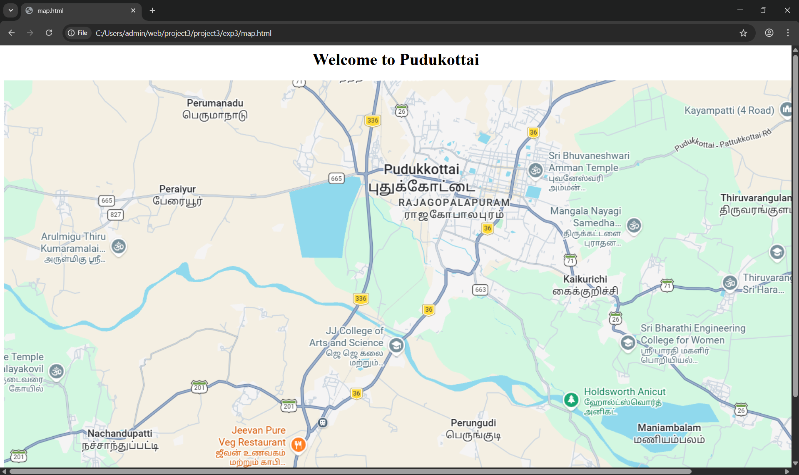
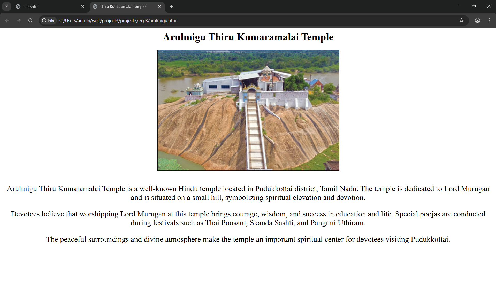
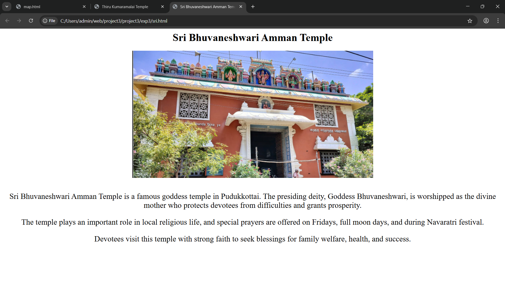
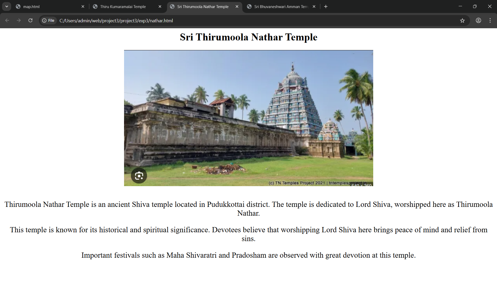
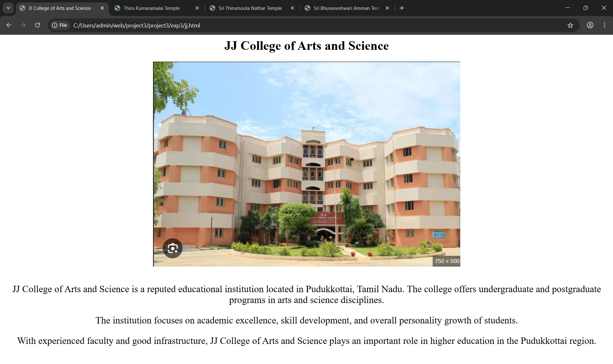

# Ex03 Places Around Me
## Date: 10-02-2025

## AIM
To develop a website to display details about the places around my house.

## DESIGN STEPS

### STEP 1
Create a Django admin interface.

### STEP 2
Download your city map from Google.

### STEP 3
Using ```<map>``` tag name the map.

### STEP 4
Create clickable regions in the image using ```<area>``` tag.

### STEP 5
Write HTML programs for all the regions identified.

### STEP 6
Execute the programs and publish them.

## CODE
### Map.html:
```html
<html>
    <head>
        <h1 align="center"> Welcome to Pudukottai </h1>
    </head>
    <center>
        
    </center>
    <map name="newmap">
        <area shape="circle" coords="129,304,24" title="Arulmigu Thiru Kumaramalai" href="arulmigu.html">
        <area shape="circle" coords="1100,162,8" title="Sri Bhuvaneshwari Amman Temple" href="sri.html">
        <area shape="circle" coords="1384,804,16" title="Sri Thirumoola Nathar Temple" href="nathar.html">
        <area shape="circle" coords="706,548,43" title="JJ College of Arts and Science" href="jj.html">
    </map>

</html>
```

### Arulmigu.html:
```html
<html>
<head>
    <center>
    <title>Thiru Kumaramalai Temple</title>
    
</head>
<body>

<h1>Arulmigu Thiru Kumaramalai Temple</h1>

    
<br><br>
<p style="font-size: 150%;">
Arulmigu Thiru Kumaramalai Temple is a well-known Hindu temple located in Pudukkottai district,
Tamil Nadu. The temple is dedicated to Lord Murugan and is situated on a small hill,
symbolizing spiritual elevation and devotion.
</p>

<p style="font-size: 150%;">
Devotees believe that worshipping Lord Murugan at this temple brings courage, wisdom,
and success in education and life. Special poojas are conducted during festivals
such as Thai Poosam, Skanda Sashti, and Panguni Uthiram.
</p>

<p style="font-size: 150%;">
The peaceful surroundings and divine atmosphere make the temple an important spiritual center
for devotees visiting Pudukkottai.
</p>

</center>

</body>
</html>
```

### sri.html
```html
<html>
<head>
    <center>
    <title>Sri Bhuvaneshwari Amman Temple</title>
    
</head>
<body>

<h1>Sri Bhuvaneshwari Amman Temple</h1>

    
<br><br>
<p style="font-size: 150%;">
Sri Bhuvaneshwari Amman Temple is a famous goddess temple in Pudukkottai.
The presiding deity, Goddess Bhuvaneshwari, is worshipped as the divine mother
who protects devotees from difficulties and grants prosperity.
</p>

<p style="font-size: 150%;">
The temple plays an important role in local religious life, and special prayers
are offered on Fridays, full moon days, and during Navaratri festival.
</p>

<p style="font-size: 150%;">
Devotees visit this temple with strong faith to seek blessings for family welfare,
health, and success.
</p>

</center>

</body>
</html>
```

### Nathar.hmtl:
```html
<html>
<head>
    <center>
    <title>Sri Thirumoola Nathar Temple</title>
    
</head>
<body>

<h1>Sri Thirumoola Nathar Temple</h1>

    
<br><br>
<p style="font-size: 150%;">
Thirumoola Nathar Temple is an ancient Shiva temple located in Pudukkottai district.
The temple is dedicated to Lord Shiva, worshipped here as Thirumoola Nathar.
</p>

<p style="font-size: 150%;">
This temple is known for its historical and spiritual significance.
Devotees believe that worshipping Lord Shiva here brings peace of mind
and relief from sins.
</p>

<p style="font-size: 150%;">
Important festivals such as Maha Shivaratri and Pradosham are observed
with great devotion at this temple.
</p>

</center>

</body>
</html>
```

### jj.html:
```html
<html>
<head>
    <center>
    <title>JJ College of Arts and Science</title>
    
</head>
<body>

<h1>JJ College of Arts and Science</h1>

    
<br><br>
<p style="font-size: 150%;">
JJ College of Arts and Science is a reputed educational institution located in Pudukkottai,
Tamil Nadu. The college offers undergraduate and postgraduate programs
in arts and science disciplines.
</p>

<p style="font-size: 150%;">
The institution focuses on academic excellence, skill development,
and overall personality growth of students.
</p>

<p style="font-size: 150%;">
With experienced faculty and good infrastructure,
JJ College of Arts and Science plays an important role in higher education
in the Pudukkottai region.

</p>

</center>

</body>
</html>
```

## OUTPUT

### MAP:


### ARULMIGU:


### Sri:


### Nathar:


### JJ:



## RESULT
The program for implementing image maps using HTML is executed successfully.
